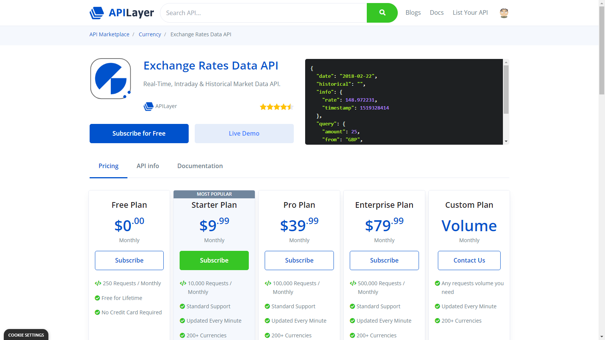

# currconv

Currency Converter CLI with Node.js, TypeScript, and Inquirer.

## Setup

### Create API Key

1. Head over to this [site](https://apilayer.com/marketplace/exchangerates_data-api).

<a href="<https://apilayer.com/marketplace/exchangerates_data-api">
    
</a>

1. Create an account on the site, subscribe to the free plan and copy the API Key.
1. Set the API Key as environment variable.

```bash
# Windows
set CURR_API_KEY=xxxxxxxxXXXXXXXX
# Mac & Linux
export CURR_API_KEY=xxxxxxxxXXXXXXXX
```

1. Run the package.

```bash
npx currconv
```
